%Brief Analysis of Doggo Height & Weight by Breed
%%Kaite Donahue, Micaela McCall, Libby Aliberti, Mia Sievers
%%%12-11-2018

# We Like Dogs
So we analyzed data about dogs 


# Our Data


- American Kennel Club dataset from data.world 
- Gives lowest and highest heights and weights for each of 150 dog breeds 

# Unicode Error Importing Our Data
- Used Pandas (pd.read_csv())
- But our csv file was a "Latin1" file or a "ISO-8859-1" file
- Added an argument to our read_csv() function that included the encoding information and eliminated the error


```python
dogs = pd.read_csv('https://query.data.world/s/wb2m35hoycwvieh3455mrac6l5ewjs', encoding="ISO-8859-1")
dogs.head()
```

# Our Data


# Created New Columns for Average Height and Weight


#Added Columns to Our Data


#Found Average Height
- Using np.mean(average_height), we found the average height to be 19.5 inches
- Which is equivalent to the average heights of these good bois:

#Kerry Blue Terrior


#Chesapeake Bay Retriever


#Histogram of Average Height
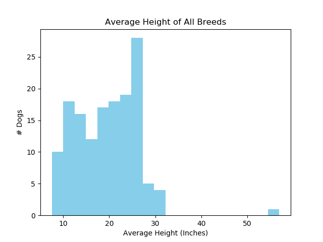
```python
# Make Histogram average height
import matplotlib.pyplot as plt
Ave_Height_Hist= plt.hist(Ave_Heights_Weights[:,0],color='skyblue', bins=20)
# Axis Labels 
plt.xlabel('Average Height (Inches)')
plt.ylabel('# Dogs')
plt.title('Average Height of All Breeds')
# Save Image 
plt.savefig('Ave_Height_Hist.png')
```

#Found Average Weight
- Using np.mean(average_weight), we found the average weight to be 50.35lbs
- Which is equivalent to the average weights of these doggos:

#Samoyed


#Dalmation


#Chinese Shar Pei


#Histogram of Average Weight
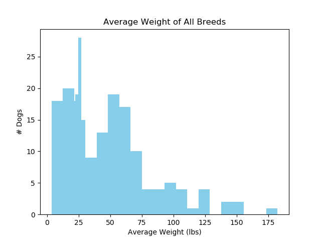
```python
# Make Histagram of Average Weight
import matplotlib.pyplot as plt
Ave_Weight_Hist=plt.hist(Ave_Heights_Weights[:,1], color="skyblue", bins=20, )
#Axis Labels
plt.xlabel('Average Weight (lbs)')
plt.ylabel('# Dogs')
plt.title('Average Weight of All Breeds')
# Save Image 
plt.savefig('Ave_Weight_Hist.png')
```

# Generated an Exploratory Pair Plot
- Wanted to take a closer look at the scatter plot and histograms
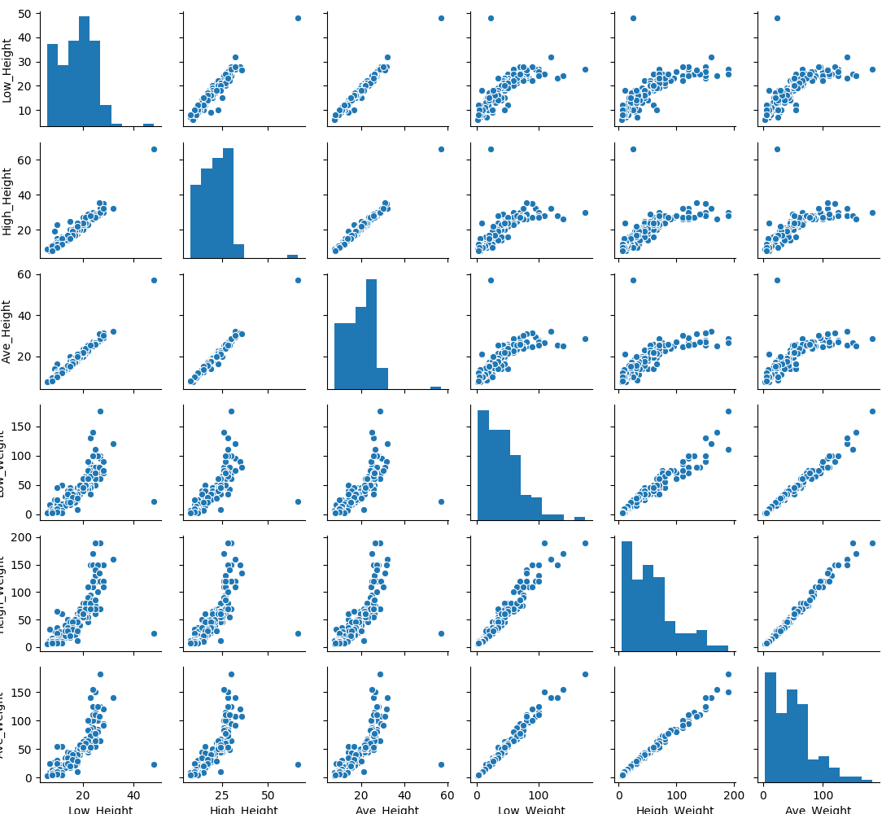


#Scatter Plot of Average Height & Weight
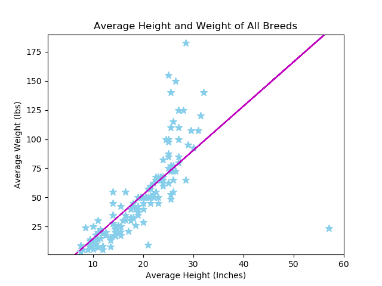
```python
#Make Scatter Plot
import matplotlib.pyplot as plt
import matplotlib.pylab as plb
Ave_scatter= plt.scatter(Ave_Heights_Weights[:,0], Ave_Heights_Weights[:,1], s=[70], marker='*',color='skyblue')
#label axis
plt.xlabel('Average Height (Inches)')
plt.ylabel('Average Weight (lbs)')
plt.title('Average Height and Weight of All Breeds')
# Set axis limits
plt.xlim(1, 60)
plt.ylim(1, 190)
# Add trendline
z = np.polyfit(Ave_Heights_Weights[:,0], Ave_Heights_Weights[:,1],1)
p = np.poly1d(z)
plb.plot(Ave_Heights_Weights, p(Ave_Heights_Weights), 'm--')
#save figure
plt.savefig('Ave_scatter.png')
```

#We wanted to explore which breeds of dogs would cluster together
So first, we used KMeans clustering, which is an unsupervised learning technique, to cluster breeds based on their characteristics.
```python
from sklearn.cluster import KMeans
from sklearn.preprocessing import StandardScaler
#scale
scaler=StandardScaler()
scaled_features=scaler.fit_transform(feature_array)

#create instance of KMeans clusters
kmeans=KMeans(n_clusters=5)

#fit to data
kmeans.fit(scaled_features)
#predict clusters
clusters=kmeans.predict(scaled_features)
``` 

#We wanted to plot these clusters
We used t-SNE to plot the data in 2-dimensional space. The graph is colored by the KMeans clusters. 

```python
from sklearn.manifold import TSNE
#create instance of t-SNE
tsne=TSNE(learning_rate=100)
#fit t-SNE featres
tsne_features=tsne.fit_transform(scaled_features)breedlist=list(breeds.values.T.flatten())

##make plot

unique_clusters=list(set(clusters))  #cluster labels
cmap=cm.get_cmap("viridis",5)  #color map
plt.scatter(x,y, alpha=0.5, c=clusters, label=unique_clusters, cmap=cmap, vmin=-0.5, vmax=4.4) #make graph
for x,y,breed in zip(x,y,breedlist):
    plt.annotate(breed, (x,y), fontsize=4, alpha=0.5)  #add labels

```

#Here is our final t-SNE plot

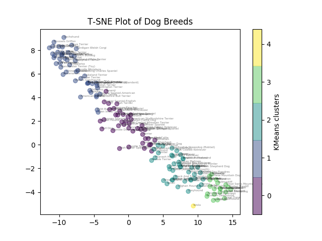


#We can look at the individual clusters to see which dogs are in them

```python
plt.scatter(x=cluster0['tsne0'],y=cluster0['tsne1'], alpha=0.5, c='red')
plt.title('KMeans Cluster 0')
zip0=zip(list(cluster0.tsne0), list(cluster0.tsne1), list(cluster0.breeds))
for x,y,breed in zip0:
    plt.annotate(breed, (x,y), fontsize=6, alpha=0.5)
plt.savefig('src/visualization/cluster0.png')
```

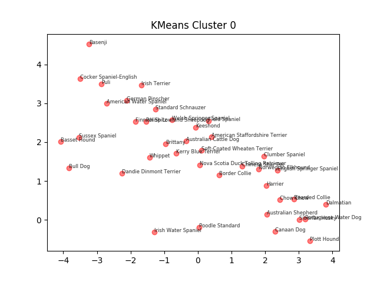

#

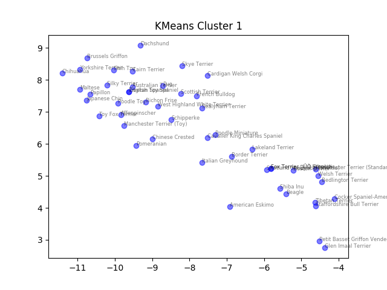

#

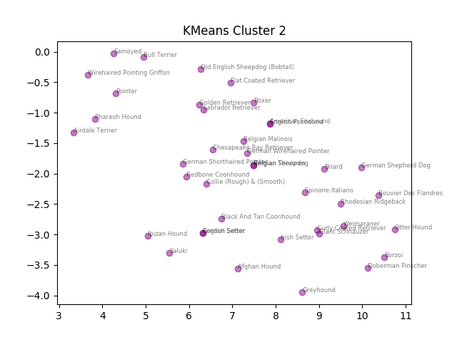

#

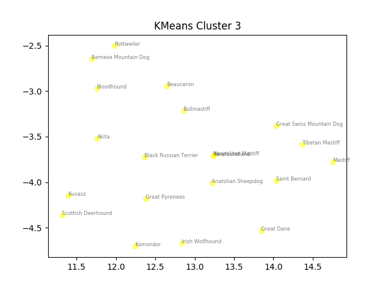

#

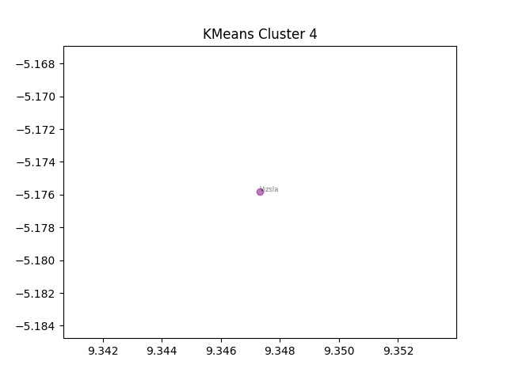

#Here are the dogs that were clustered together by the KMearns clustering

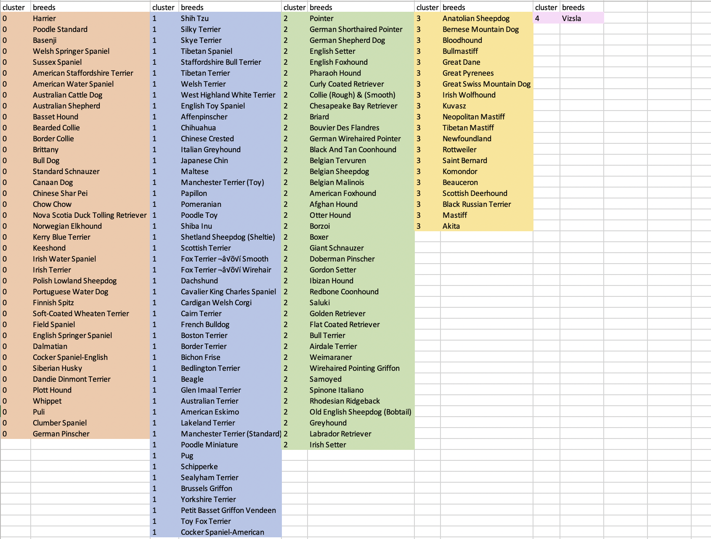

#Conclusions
- Our data formed 5 clusters based on height & weight 
- The average height was 19.5 inches and the average weight was 50.35 pounds, which is the average size of a Chesapeake Bay Retriever!


#Happy Holidays from Gitcha-Head-in-the-Game


